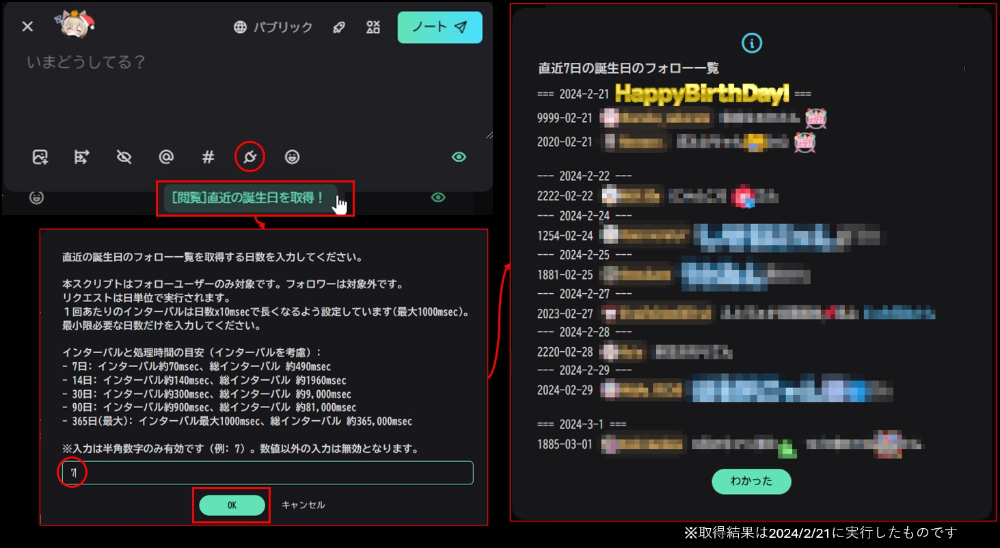

# misskey-birth-viewer-plugin
このMisskeyプラグインは、フォローしているユーザーの中で、誕生日が近い人々を見つけ出し、一覧表示します。特別な日を忘れずに、友達や知り合いに温かいメッセージを送れるようにしましょう。
[AiScript](https://github.com/syuilo/aiscript/tree/master)によって記述されています。
本プラグインはアイデアベースで試作したもののため、仕様は暫定的です。
本プラグインは、フォローユーザーのみを対象としています。

## 新機能と改善点
- ユーザーが直接日数を入力できる機能を追加しました。
- 設定項目を追加し、カスタマイズ可能になりました。
- 処理時間の見積もりをより正確に行えるようにしました。

## 使い方
ノート投稿部の`プラグイン`ボタン > `[閲覧]直近の誕生日を取得！`を選択し、表示される入力フォームにて取得する日数を入力すると、ダイアログウインドウにてフォローユーザーの誕生日一覧が表示されます。入力は半角数字のみ有効で、最大365日まで指定できます。



## 導入
1. [`release`](https://github.com/hatopopvr/misskey-birth-viewer-plugin/releases)から`MisskeyBirthViewer.is`をダウンロードします。
2. ダウンロードした内容を全てコピーします。
3. Misskeyの`設定 > プラグインのインストール`のテキストエリアに貼付けます。
4. `インストール`ボタンを押します。

###  カスタムCSSでのダイアログの表示調整
以下のCSSは、ダイアログのテキスト表示を左詰めにし、ウインドウサイズを拡大するためのものです。デフォルトではテキストは中央揃えで、ウインドウサイズが小さいため、カスタムCSSで調整することをお勧めします。
```css
.xa5A4 {
    min-width: 320px;
    max-width: 2000px;  /* original 480px; */
    box-sizing: border-box;
    text-align: left; /* original center; */
}
```

## 作者
[@hatopop_vr@misskey.io](https://misskey.io/@hatopop_vr)